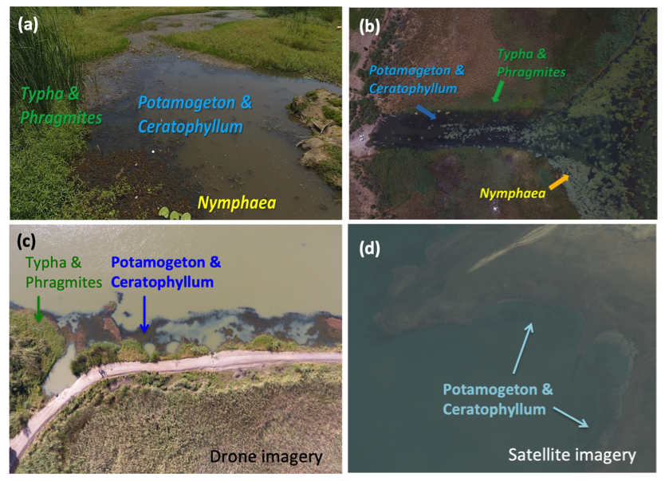
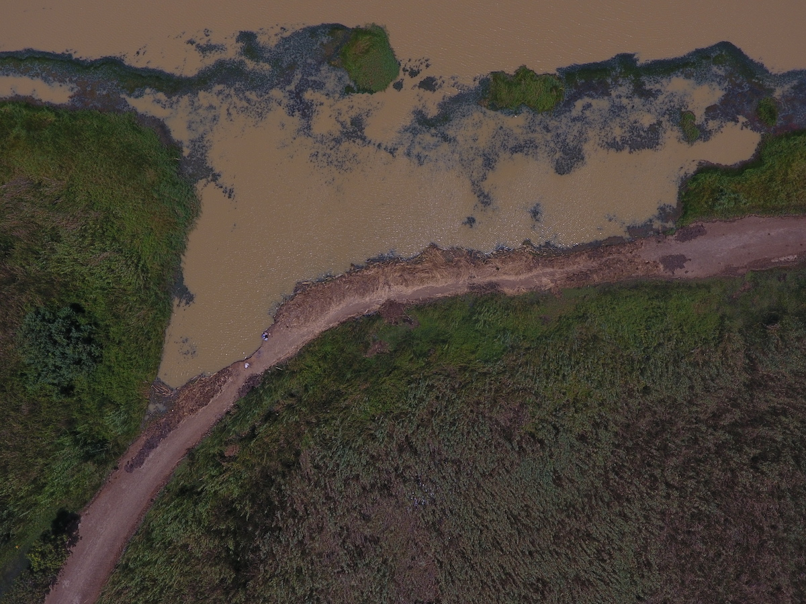
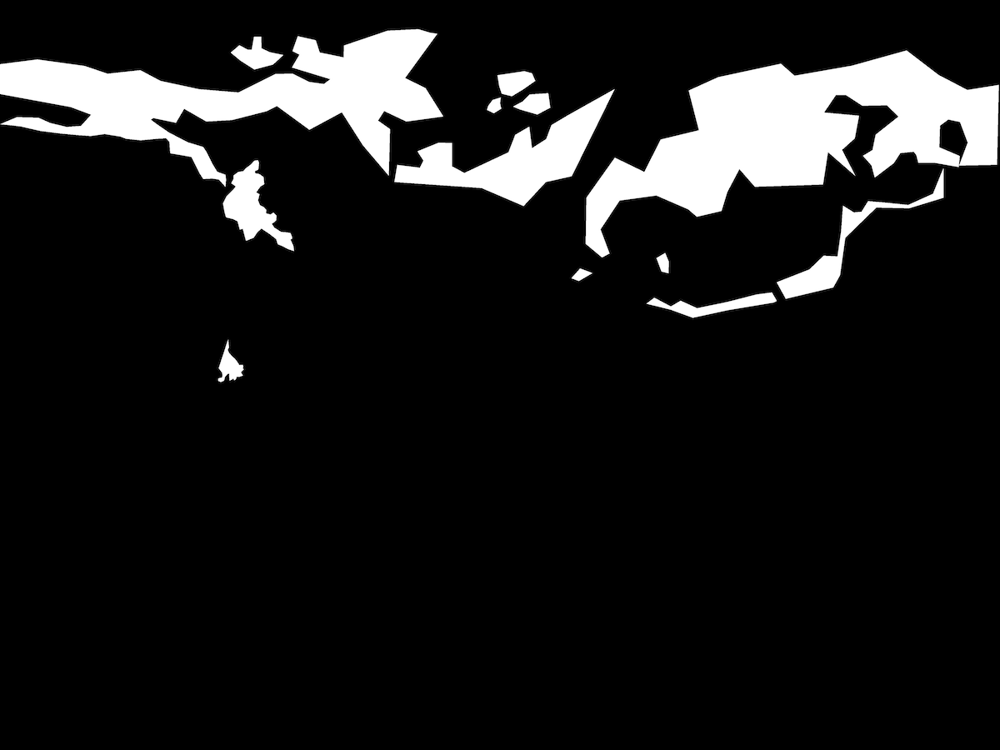
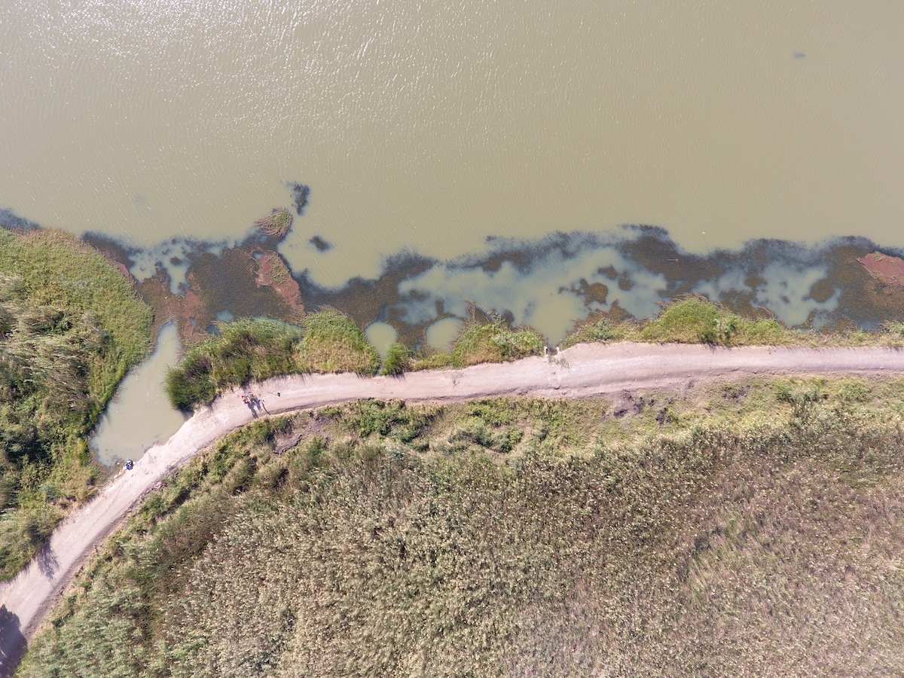
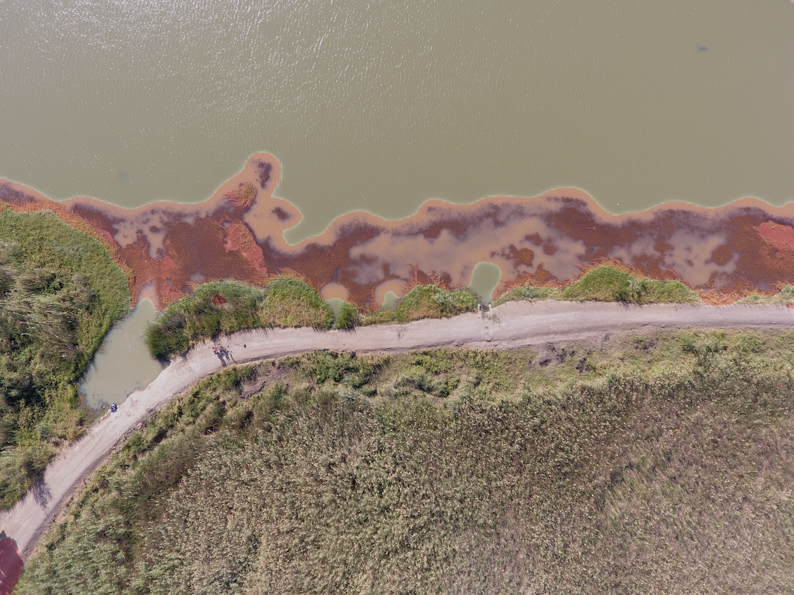

# Schisto-vegetation-drone
CNNs, U-Net model, Keras, TensorFlow backened, Semantic segmentation

## Introduction
Schistosomiasis is a debilitating parasitic disease of poverty that affects more than 200 million people worldwide, mostly in sub-Saharan Africa that has been associated with the construction of dams and water infrastructure in tropical areas. Changes in hydrology and salinity associated with water infrastructure create conditions favorable to the aquatic vegetation that is suitable habitat for the intermediate snail hosts of schistosome parasites. With thousands of water reservoirs and irrigation canals developed or under construction in Africa, it is crucial to accurately assess the spatial distribution of freshwater intermediate snail hosts in rapidly changing ecosystems. Yet, standard techniques for monitoring snails are labor intensive, time consuming, and provide information limited to the small areas that are manually sampled. Consequently, in low-income countries where schistosomiasis control is needed most, large-scale programs to fight this disease generally operate with little understanding of where transmission hotspots are, and what types of environmental interventions will be most effective. 

As part of Stanford's [Program for Disease Ecology, Health and the Environment](https://ecohealthsolutions.stanford.edu/), our research team developed a new framework [1] to assess schistosomiasis risk across large spatial scales in the Senegal River Basin (SRB) that integrates satellite data, high definition, low-cost drone imagery, and a computer vision technique, semantic segmentation. A deep learning model (U-Net) [2] was built to automatically analyze remote sensing imagery to produce segmentation maps of aquatic vegetation. Accurate and up-to-date knowledge of areas at highest risk for disease transmission can increase the effectiveness of control interventions by targeting habitat of disease-carrying snails. With the deployment of this new framework, local governments might better target environmental interventions to where and when they are most needed in an integrated effort to reach the goal of schistosomiasis elimination.

During field missions at Senegal River Basin (SRB) in 2017-2019, our team acquired more than 6,000 high-resolution drone images using a consumer drone DJI™ Phantom IV. Each image consisted of RGB bands with average ground sample distance (GSD) of 2.31 cm/pixel, with an average flight altitude of about 50 m above ground level, covering total area of 15 km2. From drone images, several types of aquatic vegetation can be identified visually: Potamogeton spp., Ceratophyllum spp., Typha spp., Phragmites spp., and Nymphaea spp. (See figure below). In most cases, Potamogeton spp. and Ceratophyllum spp. are associated with each other and are `floating` or lightly rooted and submerged in the water, while Typha spp. and Phragmites spp. form tall, dense stands of `emergent` vegetation near the edges of the water.



(a) Typical vegetation types found at the water access points in the SRB, as seen from the shore line (b) and through drone imagery (c) and satellite imagery (d). Specific vegetation types are a key indicator of snail presence and abundance, and extends far beyond the area safely sampled by trained technicians, thus limiting accurate estimates for human disease-risk.

Preliminary analyses from our fieldwork [3] show that Bulinus spp. snails (obligate intermediate hosts for S. haematobium) are strongly associated with `floating` and lightly rooted aquatic vegetation, specifically the abundant plant Ceratophyllum spp. that appears in 'dark blue' color patches on the water in drone images. We used drone images as training dataset to develop an U-Net model that segments 'dark-blue' aquatic vegetation in the image with high accuracy (85%). Note that we focus only on drone images in this repository.

In addition, by working with IBM's Cognitive Open Technologies & Performance Group, we built a Javascript web application that incorporates with our segmentation model, which allows users to upload their own drone images and the U-Net model will provide segmentation suggestion for your drone images. The web application is located [here]() (under construction).

## Mask/ Label
We define two classes for the semtantic segmentation task, including floating and emergent. We manually annotated selected drone images to create a binary mask for each class. Therefore, for each image, there are two binary masks representing two classes. For example, the floating mask contains pixel value of 1 belonging to floating vegetation class (white color) and 0 to anything else (black color). We used [Labelbox](https://www.labelbox.com/) to create mask on target vegetation features, as a team effort. Labelbox allows multiple users to label/ create masks on the images together.




## Data
The `dataset` folder in this repository is empty. You can download the sample dataset [here](https://drive.google.com/file/d/1iYgm1cz4Tocx-dP86igN7VqdKOeXzTHh/view?usp=sharing) (including label masks). The file structure is shown below:

```
    ├── dataset                   <- root
        ├── training_set          <- training set folders
        |   ├── images            <- drone image files for training
        |   ├── floating        
        |   |      └── mask       <- mask image files
        |   └── emergent          
        |          └── mask       <- mask image files
        |
        ├── test_set              <- validation set folders
        |      ├── images         <- drone image files for testing
        |      └── pred_masks     <- predicted mask files (empty before testing)    

```  

## Code
The script is in Python, building CNNs and U-Net model, using Keras package with Tensorflow backened. Augmenting in training data is also built in the code. Main script for training is `main_train.py` where you can adjust model parameters, such as batch size and training epoch. U-Net model building and data preprocessing are in `model_train.py`, where you can adjust hyperparameters, such as drop out rate. Main script for making predictions for validation set is `main_validation.py`; loading weights and model building are handled in `model_validation.py`. `.py` is the utility script for plotting confusion matrix of the results.

## Run
For training, run:
```
python main_train.py
```
The script will: 
- (1) Preprocess drone images, perform data augmentation
- (2) Perform the training
- (3) Save the weights (HDF5 file, such as`unet.hdf5`)
- (4) Report accuracy on validation set

For testing, run:
```
python main_test.py
```
The script will:
- (1) Load the weights (HDF5 file, such as`unet.hdf5`)
- (2) Produce segmentation maps from test images

## Results
The best model (`unet_keras_flow_cera.hdf5`) segments dark-blue floating vegetation with 85% accuracy. The `hdf5` file can be downloaded [here](https://drive.google.com/file/d/1fmM8JZvY1Z_aECE5nHYXy-CQd0w4TbOF/view?usp=sharing).




## Re-train for new data
You can use the code to build a new model for your own drone data, but you need to create label masks and may need to make further modifications on the code.

## Requirements
- [Anaconda / Python 3](https://www.continuum.io/downloads)
- [TensorFlow 1.12](https://www.tensorflow.org/)
- [Keras 2.2](https://keras.io/)
- [Pillow 6.2.0](https://pillow.readthedocs.io/en/stable/)
- [scikit-image 0.15.0](https://scikit-image.org/)

## Optional:
- [sklearn 0.16](https://scikit-learn.org/stable/)

## Relevant links
Links:
- [The Program for Disease Ecology, Health and the Environment](http://www.theupstreamalliance.org/)
- [Prawn vs. Snail: Nature’s Role in Fighting Disease](https://woods.stanford.edu/news-events/news/prawn-vs-snail-natures-role-fighting-disease)

## References
- [1] Liu ZY-C, Chamberlin AJ, Lamore LL, Bauer J, Jones IJ, Van Eck P, Ngo T, Sokolow SH, Lambin EF, De Leo GA. Deep learning segmentation of satellite imagery identifies aquatic vegetation associated with schistosomiasis snail hosts in Senegal, Africa. Remote Sensing. 2019 (in prep.).
- [2] Ronneberger O, Fischer P, Brox T. U-net: Convolutional networks for biomedical image segmentation. 2015. In International Conference on Medical image computing and computer-assisted intervention (pp. 234-241).
- [3] Wood CL, Sokolow S, Jones I, Chamberlin A, Lafferty KD, Kuris AM, et al. Habitat area integrates over spatial and temporal variability in snail abundance to predict human urogenital schistosomiasis burden. 2019 (in press).

## Contact
achamb@stanford.edu; zacycliu@stanford.edu or ssokolow@stanford.edu

## Last updated
Oct 8, 2019
